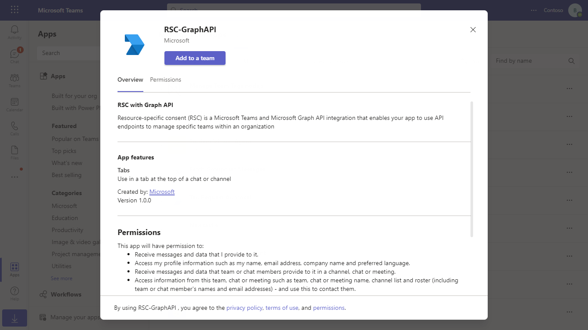
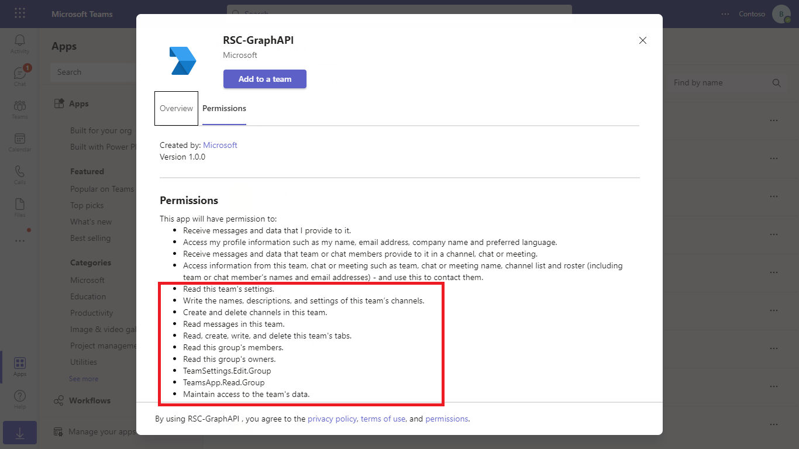

# RSC with Graph API

This sample illustrates you can use [Resource Specific Consent (RSC)](https://docs.microsoft.com/microsoftteams/platform/graph-api/rsc/resource-specific-consent) to call Graph APIs.

## Included Features
* Tabs
* RSC Permissions

## Interaction with app


## Try it yourself - experience the App in your Microsoft Teams client
Please find below demo manifest which is deployed on Microsoft Azure and you can try it yourself by uploading the app package (.zip file link below) to your teams and/or as a personal app. (Sideloading must be enabled for your tenant, [see steps here](https://docs.microsoft.com/microsoftteams/platform/concepts/build-and-test/prepare-your-o365-tenant#enable-custom-teams-apps-and-turn-on-custom-app-uploading)).

**RSC with Graph API:** [Manifest](/samples/graph-rsc/csharp/demo-manifest/graph-rsc.zip)

## Prerequisites

- [.NET Core SDK](https://dotnet.microsoft.com/download) version 6.0

  ```bash
  # determine dotnet version
  dotnet --version
  ```

- [Graph explorer](https://developer.microsoft.com//graph/graph-explorer)    

## Setup

1) Register your app with Microsoft identity platform via the Azure AD portal (AAD app registration)
    - Your app must be registered in the Azure AD portal to integrate with the Microsoft identity platform and call Microsoft Graph APIs. See [Register an application with the Microsoft identity platform](https://docs.microsoft.com/graph/auth-register-app-v2). 

2) Clone the repository
   ```bash
   git clone https://github.com/OfficeDev/microsoft-teams-samples.git
   ```

3) Build your solution
      - Launch Visual Studio
      - File -> Open -> Project/Solution
      - Navigate to `samples/graph-rsc` folder
      - Select `RSCDemo.sln` file
      - Build the solution

4) Setup ngrok
      ```bash
      ngrok http -host-header=rewrite 3978
      ```

5)  Update appsettings.json
    - Update configuration for `<<Client Id>>` and `<<Client Secret>>` with the ```MicrosoftAppId``` and ```MicrosoftAppPassword``` which was generated while doing AAD pp registration in your Azure Portal.

6) Run the bot from Visual Studio: 
    - Press `F5` to run the project

7) Setup the `manifest.json` in the `/AppPackage` folder 
   Replace the following details:
    - Replace `<<Your Microsoft APP Id>>` at all the places with your MicrosoftAppId received while doing AAD app registration in Azure portal
    - `[Your Ngrok Domain]` with base Url domain. E.g. if you are using ngrok it would be `https://1234.ngrok.io` then your domain-name will be `1234.ngrok.io`.
    - **Zip** up the contents of the `Manifest` folder to create a `manifest.zip`
    - **Upload** the `manifest.zip` to Teams (in the Apps view click "Upload a custom app")

## Running the sample

**App review:**
 

**App permission:**
 

**Permission list:**
 

## Further Reading.

- [Graph RSC](https://learn.microsoft.com/microsoftteams/platform/graph-api/rsc/resource-specific-consent)
- [Upload app manifest file](https://docs.microsoft.com/microsoftteams/platform/concepts/deploy-and-publish/apps-upload#load-your-package-into-teams) (zip file) to your team.