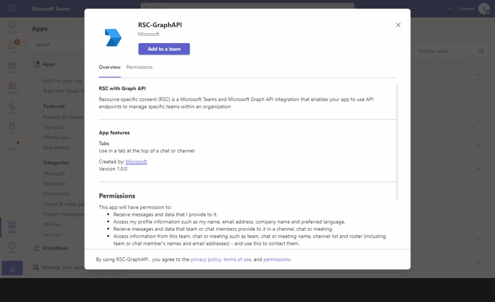
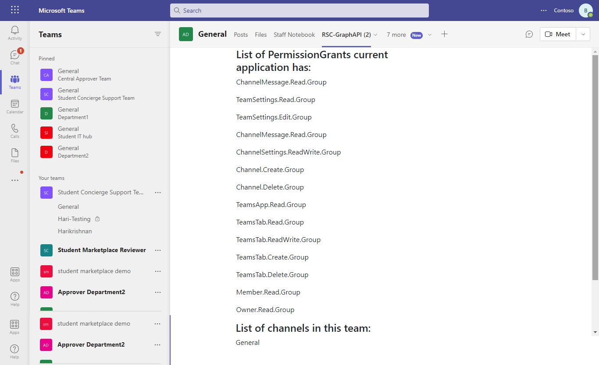

# RSC with Graph API

This sample illustrates you can use [Resource Specific Consent (RSC)](https://docs.microsoft.com/en-us/microsoftteams/platform/graph-api/rsc/resource-specific-consent) to call Graph APIs.

## Features of samples RSC

 

##  Features of samples

 

 

 

## Prerequisites

- [.NET Core SDK](https://dotnet.microsoft.com/download) version 3.1

  ```bash
  # determine dotnet version
  dotnet --version
  ```
- [Graph explorer](https://developer.microsoft.com/en-us/graph/graph-explorer)  
  

## To try this sample

1. Register your app with Microsoft identity platform via the Azure AD portal
    - Your app must be registered in the Azure AD portal to integrate with the Microsoft identity platform and call Microsoft Graph APIs. See [Register an application with the Microsoft identity platform](https://docs.microsoft.com/en-us/graph/auth-register-app-v2). 

1. Clone the repository 
   ```bash
   git clone https://github.com/OfficeDev/microsoft-teams-samples.git
   ```

1. Build your solution
      - Launch Visual Studio
      - File -> Open -> Project/Solution
      - Navigate to `samples/graph-rsc` folder
      - Select `RSCDemo.sln` file
      - Build the solution

1. Setup ngrok
      ```bash
      ngrok http -host-header=rewrite 3978
      ```

1. Config changes: 
    - Add your client id, client secret  in appsettings.json
    - Press `F5` to run the project
    - Update the ngrok in manifest 
    - Zip all three files present in manifest folder.


1. [Upload app manifest file](https://docs.microsoft.com/en-us/microsoftteams/platform/concepts/deploy-and-publish/apps-upload#load-your-package-into-teams) (zip file) to your team
   


